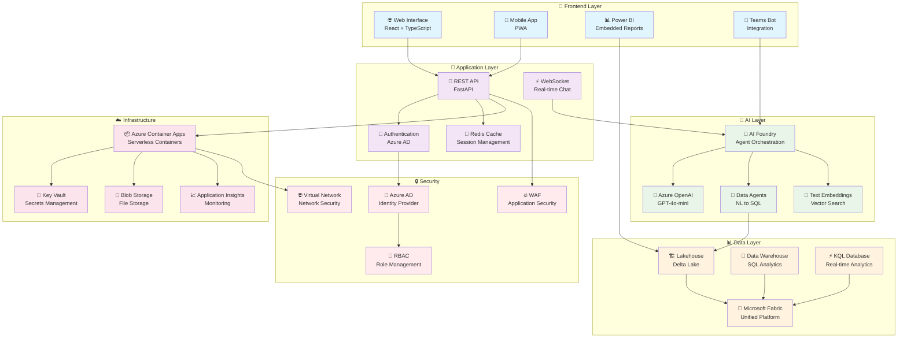
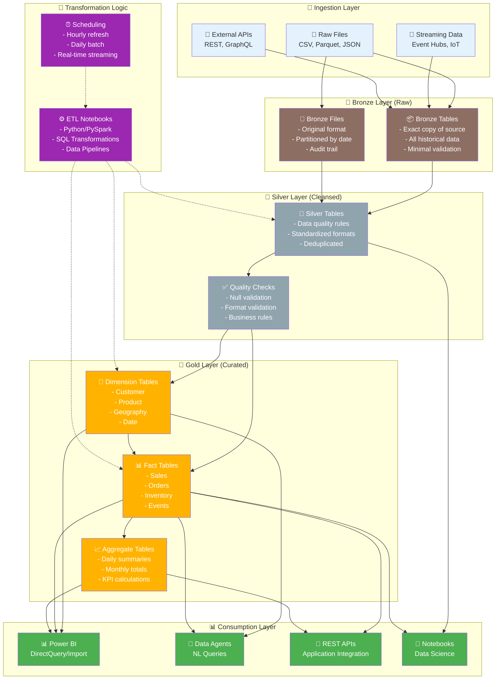
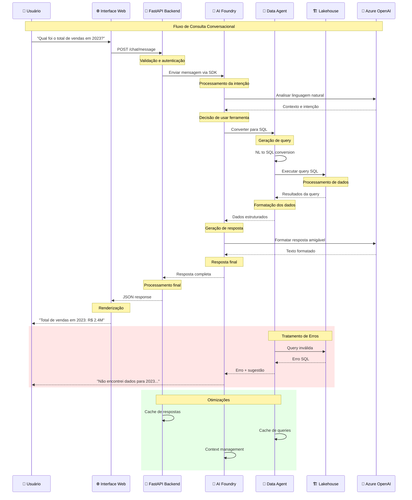

# 📊 Diagramas de Arquitetura - Microsoft Fabric Workshop

## 🎯 Visão Geral

Esta pasta contém diagramas de arquitetura da solução workshop em diferentes formatos para facilitar o entendimento técnico.

## 📁 Conteúdo

### Diagramas Principais

| Arquivo | Descrição | Formato |
|---------|-----------|---------|
| [overall-architecture.md](#overall-architecture) | Arquitetura geral da solução | Mermaid |
| [data-flow.md](#data-flow) | Fluxo de dados ETL/ELT | Mermaid |
| [conversational-flow.md](#conversational-flow) | Fluxo conversacional | Mermaid |
| [security-model.md](#security-model) | Modelo de segurança | Mermaid |

---

## Overall Architecture



---

## Data Flow



---

## Conversational Flow



---

## Security Model

```mermaid
graph TB
    subgraph "🔐 Identity Layer"
        AAD[🔐 Azure Active Directory<br/>- User authentication<br/>- Service principals<br/>- Conditional access]
        MFA[📱 Multi-Factor Auth<br/>- SMS/App verification<br/>- Hardware tokens<br/>- Biometric]
        PIM[👑 Privileged Identity<br/>- Just-in-time access<br/>- Approval workflows<br/>- Time-bound roles]
    end
    
    subgraph "🛡️ Authorization Layer"
        RBAC[👥 Role-Based Access<br/>- Admin<br/>- Contributor<br/>- Viewer<br/>- Custom roles]
        ABAC[🏷️ Attribute-Based<br/>- Department<br/>- Location<br/>- Clearance level<br/>- Time-based]
        RLS[🔒 Row-Level Security<br/>- Customer data isolation<br/>- Regional restrictions<br/>- Hierarchical access]
    end
    
    subgraph "🔒 Data Protection"
        Encryption[🔐 Encryption<br/>- At rest (AES-256)<br/>- In transit (TLS 1.3)<br/>- Customer-managed keys]
        DLP[🛡️ Data Loss Prevention<br/>- Sensitive data detection<br/>- Policy enforcement<br/>- Incident response]
        Masking[🎭 Data Masking<br/>- Dynamic masking<br/>- Static masking<br/>- Tokenization]
    end
    
    subgraph "🌐 Network Security"
        VNet[🌐 Virtual Network<br/>- Network isolation<br/>- Subnet segmentation<br/>- NSG rules]
        Firewall[🔥 Web App Firewall<br/>- OWASP protection<br/>- Rate limiting<br/>- Bot protection]
        PrivateLink[🔗 Private Endpoints<br/>- No public internet<br/>- DNS integration<br/>- Traffic isolation]
    end
    
    subgraph "📊 Monitoring & Compliance"
        Audit[📋 Audit Logging<br/>- All data access<br/>- Administrative actions<br/>- Query execution<br/>- Failed attempts]
        SIEM[🚨 Security Information<br/>- Real-time monitoring<br/>- Threat detection<br/>- Incident response]
        Compliance[✅ Compliance<br/>- GDPR compliance<br/>- SOC 2 certification<br/>- Industry standards]
    end
    
    subgraph "🔑 Secrets Management"
        KeyVault[🔐 Azure Key Vault<br/>- API keys<br/>- Connection strings<br/>- Certificates<br/>- Encryption keys]
        MSI[🎭 Managed Identity<br/>- No stored credentials<br/>- Automatic rotation<br/>- Azure AD integration]
        Rotation[🔄 Key Rotation<br/>- Automated rotation<br/>- Version management<br/>- Zero-downtime updates]
    end
    
    %% Connections showing security flow
    AAD --> RBAC
    AAD --> MFA
    AAD --> PIM
    
    RBAC --> RLS
    ABAC --> RLS
    PIM --> RBAC
    
    Encryption --> DLP
    DLP --> Masking
    
    VNet --> PrivateLink
    Firewall --> VNet
    
    Audit --> SIEM
    SIEM --> Compliance
    
    KeyVault --> MSI
    MSI --> Rotation
    
    %% Data flow security
    RLS -.-> Audit
    Masking -.-> Audit
    PrivateLink -.-> Audit
    
    %% Styling
    classDef identity fill:#e8eaf6
    classDef authorization fill:#f3e5f5
    classDef protection fill:#e0f2f1
    classDef network fill:#fff3e0
    classDef monitoring fill:#fce4ec
    classDef secrets fill:#f1f8e9
    
    class AAD,MFA,PIM identity
    class RBAC,ABAC,RLS authorization
    class Encryption,DLP,Masking protection
    class VNet,Firewall,PrivateLink network
    class Audit,SIEM,Compliance monitoring
    class KeyVault,MSI,Rotation secrets
```

---

## 📝 Como Usar os Diagramas

### No GitHub
Os diagramas Mermaid são renderizados automaticamente no GitHub quando visualizados em arquivos `.md`.

### Localmente
1. **VS Code:** Use a extensão "Mermaid Preview"
2. **Browser:** Use o [Mermaid Live Editor](https://mermaid.live/)
3. **Exportar:** Converta para PNG/SVG usando ferramentas online

### Em Documentação
```markdown
<!-- Incluir diagrama -->

```

### Personalização
Os diagramas podem ser editados para refletir:
- Configurações específicas do ambiente
- Componentes adicionais implementados
- Fluxos customizados por organização

---

**💡 Dica:** Mantenha os diagramas atualizados conforme a arquitetura evolui!