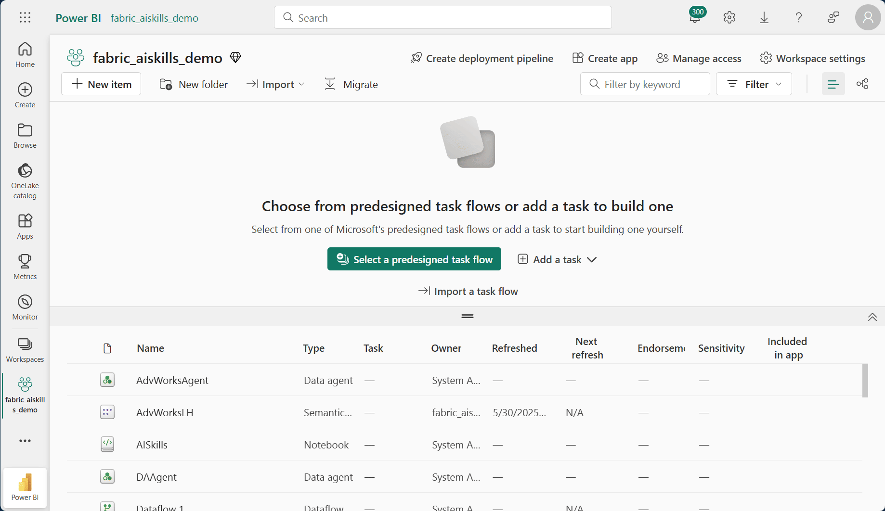
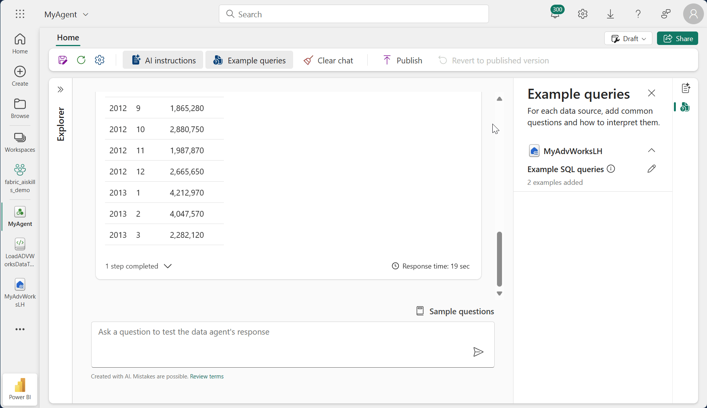

# Introdução ao Fabric Data Agents

## Preparando o Ambiente

Verifique se possui os [prerequisitos necessários](https://learn.microsoft.com/pt-br/fabric/data-science/data-agent-scenario)

## Lakehouse Simples para o Agente
- Crie um Lakehouse no Fabric.  



- Crie um notebook dentro do Lakehouse ou Faça o Upload do Notebook [LoadADVWorksDataToLH](../assets/notebooks/LoadADVWorksDataToLH.ipynb).  
- Connect o notebook ao Lakehouse e execute a celula (Se tiver erro com a leitura do blob storage, faça upload dos arquivos e execute a celula de integração manual).  


- Crie um Data Agent
- Selecione os dados *(dimcustomer, dimdate, dimgeography, dimproduct, dimproductcategory, dimpromotion, dimreseller, dimsalesterritory, factinternetsales, factresellersales)*


- Forneça as instruções:  
    ```
    A fonte de dados AdventureWorksLH contém informações de três tabelas:

    - dimcustomer, para informações detalhadas de dados demográficos e de contato do cliente.  
    - dimdate, para dados relacionados à data – por exemplo, informações de calendário e fiscais.  
    - dimgeography, para obter detalhes geográficos, incluindo nomes de cidade e códigos de região do país.  
    
    Use essa fonte de dados para consultas e análises que envolvem detalhes do cliente, eventos baseados em tempo e localizações geográficas.  
    ```

- Adicione as queries de exemplo: 
    ```
    # Questão
    Question: Calculate the average percentage increase in sales amount for repeat purchases for every zipcode. Repeat purchase is a purchase subsequent to the first purchase (the average should always be computed relative to the first purchase)
    --- 
    # Query
    SELECT AVG((s.SalesAmount - first_purchase.SalesAmount) / first_purchase.SalesAmount * 100) AS AvgPercentageIncrease
    FROM factinternetsales s
    INNER JOIN dimcustomer c ON s.CustomerKey = c.CustomerKey
    INNER JOIN dimgeography g ON c.GeographyKey = g.GeographyKey
    INNER JOIN (
        SELECT *
        FROM (
            SELECT
                CustomerKey,
                SalesAmount,
                OrderDate,
                ROW_NUMBER() OVER (PARTITION BY CustomerKey ORDER BY OrderDate) AS RowNumber
            FROM factinternetsales
        ) AS t
        WHERE RowNumber = 1
    ) first_purchase ON s.CustomerKey = first_purchase.CustomerKey
    WHERE s.OrderDate > first_purchase.OrderDate
    GROUP BY g.PostalCode;
    ```

    ```
    # Questão
    Question: Show the monthly total and year-to-date total sales. Order by year and month.
    --- 
    # Query
    SELECT
    Year,
	Month,
	MonthlySales,
	SUM(MonthlySales) OVER (PARTITION BY Year ORDER BY Year, Month ROWS BETWEEN UNBOUNDED PRECEDING AND CURRENT ROW) AS CumulativeTotal
    FROM (
        SELECT
        YEAR(OrderDate) AS Year,
        MONTH(OrderDate) AS Month,
        SUM(SalesAmount) AS MonthlySales
        FROM factinternetsales
        GROUP BY YEAR(OrderDate), MONTH(OrderDate)
    ) AS t;
    ```
- Teste o agente com algumas perguntas
- Publique o Agente  



- Pegue as informações do Agente nas configurações de publicação  
  Exemplo de URL: `https://api.fabric.microsoft.com/v1/workspaces/<workspace-id>/aiskills/<artifact-id>/aiassistant/openai`

> Certifique-se que fez a criação do recurso de projetos do AI Foundry corretamente conforme os pre-requisitos.  

- Connecte o Agente ao AI Foundry
    Use instruções como essa de exemplo `You are a helpfull data agent that ALWAYS USE MyAgent Knowledge TOOL to retrieve dataset information for user.`


- Pegue os endpoints para usar no chatbot.
- Teste o chatbot.

## Opcional
É possivel também compartilhar o data agente com o Copilot Studio e com o Teams.  
Também é possivel usar ele dentro dos notebooks do Fabric.  


## Referências
- [Exemplo do agente de dados do Fabric com o conjunto de dados do AdventureWorks (versão prévia)](https://learn.microsoft.com/pt-br/fabric/data-science/data-agent-scenario)
- [Consumir um Agente de Dados Fabric do Copilot no Power BI (versão prévia)](https://learn.microsoft.com/pt-br/fabric/data-science/data-agent-copilot-powerbi)

