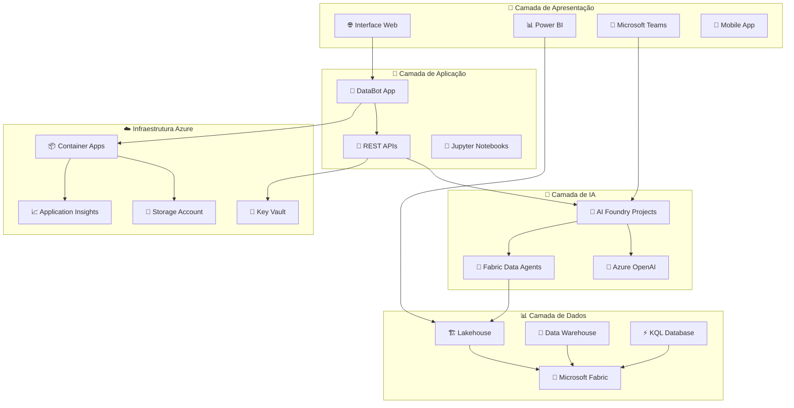
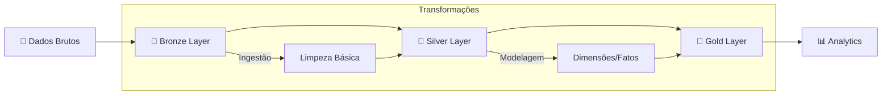
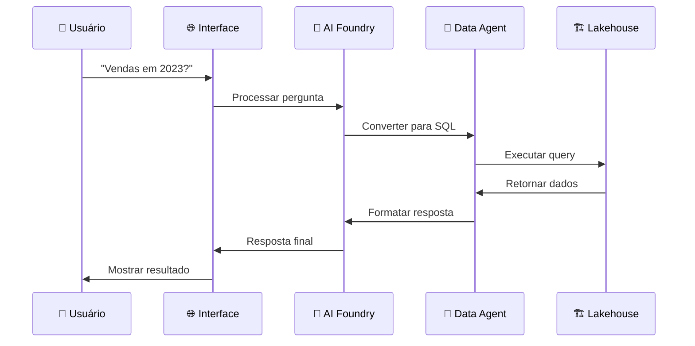
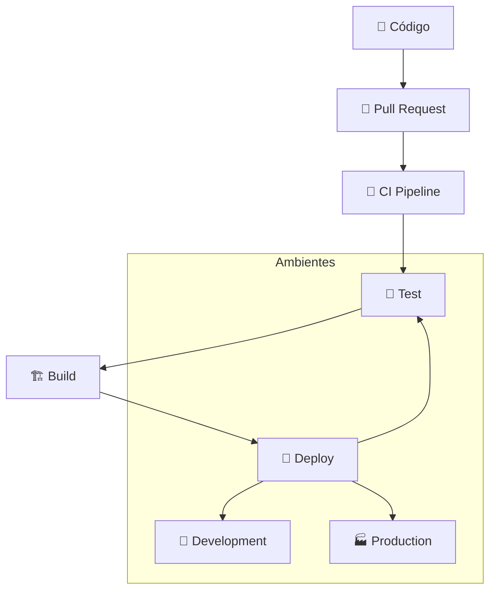
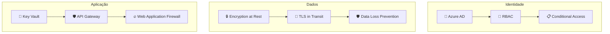
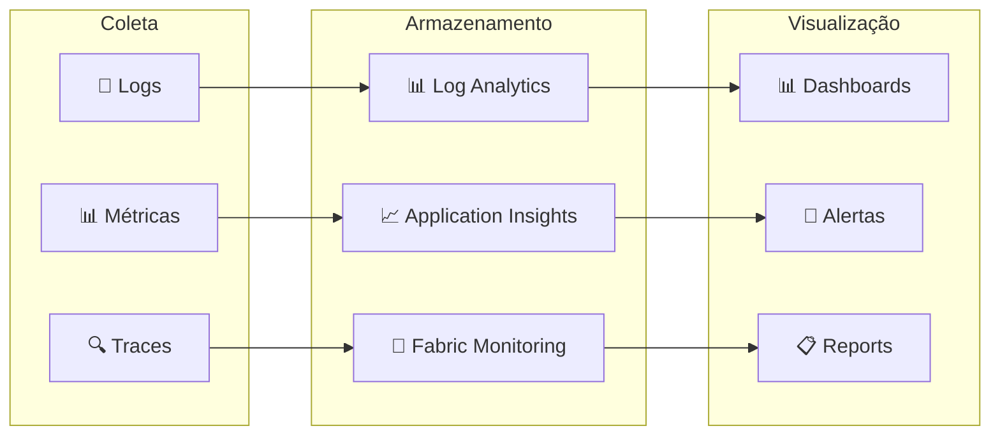

# 🏗️ Visão Geral da Arquitetura - Microsoft Fabric Workshop

## 📋 Introdução

Este documento descreve a arquitetura geral da solução workshop do Microsoft Fabric, incluindo todos os componentes, fluxos de dados e integrações.

## 🎯 Objetivos Arquiteturais

### Princípios de Design
- ✅ **Modularidade:** Componentes independentes e reutilizáveis
- ✅ **Escalabilidade:** Suporte a diferentes volumes de dados
- ✅ **Flexibilidade:** Fácil extensão e customização
- ✅ **Observabilidade:** Monitoramento e logs abrangentes
- ✅ **Segurança:** Controle de acesso e proteção de dados

### Casos de Uso Suportados
- 📊 **Analytics Self-Service:** Consultas ad-hoc em linguagem natural
- 🔄 **ETL/ELT:** Transformações de dados estruturadas
- 🤖 **IA Conversacional:** Chatbots inteligentes para dados
- 📈 **Relatórios:** Dashboards e visualizações
- 🔧 **DevOps:** Deploy automatizado e CI/CD

## 🏗️ Arquitetura de Alto Nível



## 🔄 Fluxos de Dados Principais

### 1. Fluxo ETL/ELT (Lakehouse)



**Características:**
- **Bronze:** Dados brutos, histórico completo
- **Silver:** Dados limpos, padronizados
- **Gold:** Modelo dimensional, pronto para BI

### 2. Fluxo Conversacional (Data Agents)



**Características:**
- **Latência:** < 5 segundos para queries simples
- **Linguagem:** Português brasileiro
- **Contexto:** Mantido durante conversa

### 3. Fluxo de Deploy (DevOps)



## 🧩 Componentes Detalhados

### Microsoft Fabric Lakehouse

**Responsabilidades:**
- Armazenamento de dados multi-formato
- Processamento distribuído com Spark
- Catálogo de dados unificado
- Integração nativa com Power BI

**Configurações:**
```yaml
Lakehouse:
  name: AdventureWorksLH
  capacity: F2 (mínimo)
  storage: Delta Lake
  compute: Spark 3.4
  security: RBAC + Row-level
```

### Azure AI Foundry Projects

**Responsabilidades:**
- Orquestração de agentes IA
- Integração com modelos OpenAI
- Gerenciamento de ferramentas
- Monitoring e logs de IA

**Configurações:**
```yaml
AIFoundry:
  region: East US
  models:
    - gpt-4o-mini: Chat/Completion
    - text-embedding-3-small: Embeddings
  tools:
    - FabricDataAgent: Custom Tool
```

### Fabric Data Agents

**Responsabilidades:**
- Conversão NL para SQL
- Execução de queries
- Validação de resultados
- Caching inteligente

**Configurações:**
```yaml
DataAgent:
  name: AdventureWorksAgent
  tables: 10 (dims + facts)
  language: pt-BR
  examples: 20+ queries
```

### DataBot Application

**Responsabilidades:**
- Interface web conversacional
- Gerenciamento de sessões
- Integração com AI Foundry
- Deployment em container

**Arquitetura:**
```yaml
DataBot:
  backend:
    tech: Python + FastAPI
    features: [REST API, WebSocket, Auth]
  frontend:
    tech: TypeScript + React
    features: [Chat UI, Real-time, PWA]
  deployment:
    platform: Azure Container Apps
    scaling: 0-10 instances
```

## 🔐 Segurança e Governança

### Modelo de Segurança



### Controles de Acesso

| Componente | Autenticação | Autorização | Auditoria |
|------------|--------------|-------------|-----------|
| Fabric Workspace | Azure AD | RBAC | Activity Log |
| Data Agent | Service Principal | Custom Roles | Query Log |
| AI Foundry | Managed Identity | Resource-based | AI Logs |
| DataBot App | OAuth 2.0 | JWT Claims | App Insights |

### Compliance e Governança

**Políticas Implementadas:**
- ✅ **Data Residency:** Dados mantidos na região escolhida
- ✅ **Retention:** Políticas de retenção configuráveis
- ✅ **Lineage:** Rastreamento de origem dos dados
- ✅ **Quality:** Validações automáticas de qualidade

## ⚡ Performance e Escalabilidade

### Otimizações de Performance

#### Lakehouse
```sql
-- Particionamento por data
CREATE TABLE gold_fact_sales (...)
PARTITIONED BY (year, month)

-- Z-Order para queries frequentes  
OPTIMIZE gold_fact_sales
ZORDER BY (customer_key, product_key)

-- Delta table optimizations
VACUUM gold_fact_sales RETAIN 168 HOURS
```

#### Data Agent
- **Caching:** Queries repetitivas em cache
- **Parallelismo:** Execução concurrent de queries
- **Sampling:** Amostras para queries exploratórias

#### DataBot Application
- **CDN:** Assets estáticos via CDN
- **Caching:** Redis para sessões
- **Auto-scaling:** Baseado em demanda

### Métricas de Performance

| Componente | Métrica | Target | Monitoramento |
|------------|---------|---------|---------------|
| Lakehouse | Query latency | < 30s | Fabric Portal |
| Data Agent | Response time | < 5s | Custom logs |
| AI Foundry | Token usage | < 1M/day | Azure Monitor |
| DataBot | Page load | < 2s | App Insights |

## 🔧 Monitoramento e Observabilidade

### Stack de Observabilidade



### Alertas Configurados

**Críticos:**
- Falha no Data Agent (> 5 min)
- Erro de autenticação (> 10/min)
- Capacity exceeded no Fabric

**Warnings:**
- Latência alta (> 30s)
- Usage quota (> 80%)
- Storage growth (> 20%/dia)

## 🔄 Disaster Recovery

### Estratégia de Backup

| Componente | Frequência | Retenção | Recovery Time |
|------------|------------|----------|---------------|
| Lakehouse Data | Diário | 30 dias | 4 horas |
| Agent Config | Weekly | 90 dias | 1 hora |
| App Code | Git | Indefinido | 30 min |
| Secrets | Sync | 30 dias | 15 min |

### Procedimentos de Recovery

1. **Lakehouse Recovery:**
   ```bash
   # Restore from backup
   az fabric lakehouse restore --backup-id <id>
   ```

2. **Application Recovery:**
   ```bash
   # Redeploy via IaC
   ./infrastructure/scripts/deploy-workshop.ps1 -Environment prod
   ```

## 📈 Roadmap Técnico

### Próximas Melhorias

**Q1 2025:**
- ✅ Real-time streaming integration
- ✅ Advanced ML models integration
- ✅ Multi-tenant support

**Q2 2025:**
- ✅ Power BI embedded reports
- ✅ Advanced security features
- ✅ Performance optimizations

**Q3 2025:**
- ✅ Mobile app development
- ✅ Voice interface integration
- ✅ Advanced analytics features

## 📚 Recursos de Referência

### Documentação Técnica
- [Microsoft Fabric Architecture](https://learn.microsoft.com/fabric/architecture/)
- [Azure AI Foundry Design Patterns](https://learn.microsoft.com/azure/ai-studio/)
- [Lakehouse Best Practices](https://learn.microsoft.com/fabric/data-engineering/)

### Padrões e Guidelines
- [Data Mesh Implementation](data-mesh-patterns.md)
- [Security Guidelines](security-guidelines.md)
- [Performance Tuning](performance-tuning.md)

---

**📐 Esta arquitetura evolui:** O design é iterativo e se adapta baseado no feedback dos usuários e novas funcionalidades do Microsoft Fabric.