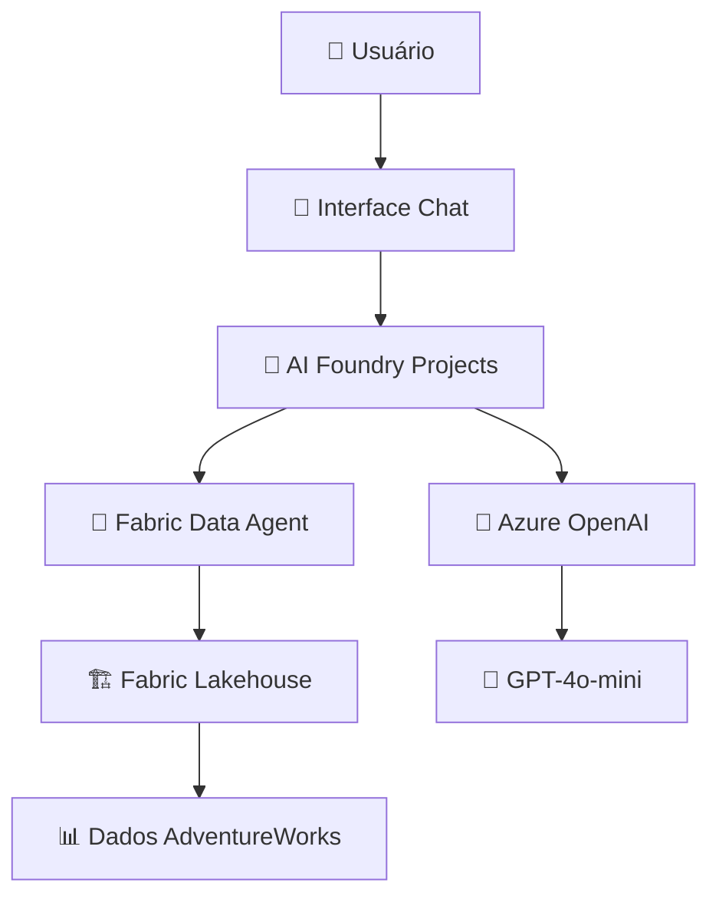

# 🤖 Workshop: Fabric Data Agents

## 📋 Índice

- [Visão Geral](#visão-geral)
- [Pré-requisitos](#pré-requisitos)
- [Arquitetura da Solução](#arquitetura-da-solução)
- [Passo-a-Passo](#passo-a-passo)
- [Integração com AI Foundry](#integração-com-ai-foundry)
- [Exemplos de Uso](#exemplos-de-uso)
- [Troubleshooting](#troubleshooting)
- [Próximos Passos](#próximos-passos)

## 🎯 Visão Geral

Este workshop ensina como criar e usar **Data Agents** no Microsoft Fabric para consultas conversacionais de dados. Você aprenderá a:

- ✅ Configurar um Lakehouse simples para o agente
- ✅ Criar e treinar um Data Agent
- ✅ Integrar com Azure AI Foundry Projects
- ✅ Desenvolver um chatbot personalizado
- ✅ Publicar e compartilhar o agente

### 🏆 Resultados Esperados
Ao final do workshop, você terá:
- Um Data Agent funcional conectado aos seus dados
- Integração com Azure AI Foundry para uso avançado
- Conhecimento de queries em linguagem natural
- Base para desenvolvimento de chatbots inteligentes

## 🔧 Pré-requisitos

### Recursos Azure Necessários
- ✅ **Microsoft Fabric** com workspace ativo
- ✅ **Azure AI Foundry Projects** configurado
- ✅ **Azure OpenAI** com modelo GPT-4o-mini
- ✅ **Lakehouse** com dados carregados

### Conhecimentos Técnicos
- 🟢 **Básico:** SQL e conceitos de IA
- 🟡 **Intermediário:** Azure services
- 🔵 **Diferencial:** Semantic Kernel e chatbot development

### Verificação de Pré-requisitos
Siga o [guia oficial](https://learn.microsoft.com/pt-br/fabric/data-science/data-agent-scenario) para verificar se possui todos os recursos necessários.

## 🏗️ Arquitetura da Solução

### Componentes Principais



### Fluxo de Dados
1. **Usuário** faz pergunta em linguagem natural
2. **AI Foundry** processa a intenção
3. **Data Agent** converte para SQL
4. **Lakehouse** executa query nos dados
5. **Resposta** é formatada e retornada

## 🚀 Passo-a-Passo

### Etapa 1: Preparação do Lakehouse

1. **Crie um Lakehouse no Fabric**
   - Nome: `AdventureWorksLH`
   - Workspace: Seu workspace ativo

2. **Upload do Notebook de Carregamento**
   - Arquivo: `workshops/lakehouse/notebooks/01-LoadADVWorksDataToLH.ipynb`
   - Conecte ao Lakehouse criado

3. **Execute o Carregamento dos Dados**
   ```python
   # O notebook carregará automaticamente:
   # - dimcustomer (18,484 registros)
   # - dimdate (2,191 registros)  
   # - dimgeography (655 registros)
   # - dimproduct (606 registros)
   # - dimproductcategory (4 registros)
   # - dimpromotion (16 registros)
   # - dimreseller (701 registros)
   # - dimsalesterritory (11 registros)
   # - factinternetsales (60,398 registros)
   # - factresellersales (60,855 registros)
   ```

### Etapa 2: Criação do Data Agent

1. **No Fabric Portal:**
   - Vá para "Data Science" experience
   - Clique em "New" → "Data Agent"
   - Nome: `AdventureWorksAgent`

2. **Seleção de Dados:**
   Selecione as seguintes tabelas do Lakehouse:
   ```
   ✅ dimcustomer
   ✅ dimdate  
   ✅ dimgeography
   ✅ dimproduct
   ✅ dimproductcategory
   ✅ dimpromotion
   ✅ dimreseller
   ✅ dimsalesterritory
   ✅ factinternetsales
   ✅ factresellersales
   ```

3. **Configuração das Instruções:**
   ```
   A fonte de dados AdventureWorksLH contém informações de três áreas principais:
   
   - CUSTOMERS: dimcustomer, dimgeography para informações de clientes e localização
   - PRODUCTS: dimproduct, dimproductcategory, dimpromotion para catálogo de produtos
   - SALES: factinternetsales, factresellersales, dimdate para transações de vendas
   
   Use essa fonte de dados para consultas e análises que envolvem:
   - Análises de vendas por período, região e produto
   - Perfil e comportamento de clientes  
   - Performance de produtos e categorias
   - Tendências temporais e sazonalidade
   ```

### Etapa 3: Treinamento com Exemplos

Adicione as seguintes queries de exemplo para treinar o agente:

#### Exemplo 1: Análise de Repeat Purchases
```sql
-- Questão: Calculate the average percentage increase in sales amount for repeat purchases for every zipcode
SELECT AVG((s.SalesAmount - first_purchase.SalesAmount) / first_purchase.SalesAmount * 100) AS AvgPercentageIncrease
FROM factinternetsales s
INNER JOIN dimcustomer c ON s.CustomerKey = c.CustomerKey
INNER JOIN dimgeography g ON c.GeographyKey = g.GeographyKey
INNER JOIN (
    SELECT *
    FROM (
        SELECT
            CustomerKey,
            SalesAmount,
            OrderDate,
            ROW_NUMBER() OVER (PARTITION BY CustomerKey ORDER BY OrderDate) AS RowNumber
        FROM factinternetsales
    ) AS t
    WHERE RowNumber = 1
) first_purchase ON s.CustomerKey = first_purchase.CustomerKey
WHERE s.OrderDate > first_purchase.OrderDate
GROUP BY g.PostalCode;
```

#### Exemplo 2: Vendas Mensais e Acumuladas
```sql
-- Questão: Show the monthly total and year-to-date total sales. Order by year and month.
SELECT
    Year,
    Month,
    MonthlySales,
    SUM(MonthlySales) OVER (
        PARTITION BY Year 
        ORDER BY Year, Month 
        ROWS BETWEEN UNBOUNDED PRECEDING AND CURRENT ROW
    ) AS CumulativeTotal
FROM (
    SELECT
        YEAR(OrderDate) AS Year,
        MONTH(OrderDate) AS Month,
        SUM(SalesAmount) AS MonthlySales
    FROM factinternetsales
    GROUP BY YEAR(OrderDate), MONTH(OrderDate)
) AS t
ORDER BY Year, Month;
```

### Etapa 4: Teste do Agente

1. **Perguntas para Testar:**
   ```
   "Qual foi o total de vendas em 2013?"
   
   "Quais são os 5 produtos mais vendidos?"
   
   "Mostrar vendas por país nos últimos 12 meses"
   
   "Qual cliente teve maior valor total de compras?"
   
   "Comparar vendas de bicicletas vs acessórios"
   ```

2. **Validação das Respostas:**
   - Verifique se SQL gerado está correto
   - Confirme se resultados fazem sentido
   - Teste edge cases e perguntas complexas

### Etapa 5: Publicação do Agente

1. **Publique o Data Agent:**
   - Clique em "Publish" no agente
   - Aguarde processamento (5-10 minutos)

2. **Obtenha as Informações de Conexão:**
   ```
   URL Example: 
   https://api.fabric.microsoft.com/v1/workspaces/<workspace-id>/aiskills/<artifact-id>/aiassistant/openai
   
   Workspace ID: [seu-workspace-id]
   Artifact ID: [seu-agent-id]
   ```

3. **Configure Autenticação:**
   - Use Azure AD authentication
   - Configure service principal se necessário

## 🤖 Integração com AI Foundry

### Etapa 1: Configuração no AI Foundry

1. **Crie um AI Foundry Project:**
   - Portal: https://ai.azure.com
   - Novo projeto conectado à sua subscription

2. **Adicione o Data Agent como Ferramenta:**
   - Vá para "Tools" no AI Foundry
   - Adicione "Custom Tool"
   - Configure endpoint do Fabric Data Agent

### Etapa 2: Configuração do Agent

```python
# Instruções de sistema para o AI Foundry Agent
system_instructions = """
Você é um assistente de dados especializado que SEMPRE USA a ferramenta MyAgent Knowledge 
para recuperar informações do dataset AdventureWorks.

REGRAS IMPORTANTES:
1. Para QUALQUER pergunta sobre dados, use a ferramenta MyAgent Knowledge
2. Formate respostas de forma clara e concisa
3. Se não encontrar dados, explique o que tentou buscar
4. Sugira perguntas alternativas quando apropriado
"""
```

### Etapa 3: Teste da Integração

1. **Perguntas de Validação:**
   ```
   "Mostre um resumo das vendas de 2014"
   
   "Quais produtos tiveram melhor performance?"
   
   "Análise de clientes por região geográfica"
   ```

2. **Verificação de Funcionamento:**
   - Confirme que ferramenta é chamada
   - Valide que dados são retornados
   - Teste formatação das respostas

## 💬 Exemplos de Uso

### Análises de Negócio

#### Performance de Vendas
```
👤 Usuário: "Como foram as vendas no último trimestre?"

🤖 Agent: Vou consultar os dados de vendas para você...

📊 Resultado: 
- Q4 2013: $2,340,123 em vendas
- Crescimento de 15% vs Q3
- Principais produtos: Mountain bikes (34%), Road bikes (28%)
```

#### Análise de Clientes
```
👤 Usuário: "Quais são os perfis de clientes mais valiosos?"

🤖 Agent: Analisando o perfil dos clientes...

📊 Resultado:
- Top 20% clientes: 65% do revenue total
- Perfil: Homens, 35-50 anos, renda alta
- Localização: Áreas metropolitanas (78%)
```

### Insights Operacionais

#### Sazonalidade
```
👤 Usuário: "Existe sazonalidade nas vendas?"

🤖 Agent: Verificando padrões sazonais...

📊 Resultado:
- Pico em Dezembro (vendas de fim de ano)
- Vale em Janeiro-Fevereiro  
- Crescimento gradual Março-Novembro
```

## 🔧 Troubleshooting

### Problemas Comuns

#### Agent não encontra dados
**Causas possíveis:**
- Lakehouse não conectado corretamente
- Tabelas não selecionadas
- Dados não carregados

**Solução:**
```sql
-- Verificar se dados existem
SELECT COUNT(*) FROM factinternetsales;
SELECT COUNT(*) FROM dimcustomer;
```

#### Queries incorretas geradas
**Causas possíveis:**
- Instruções pouco claras
- Falta de exemplos de treinamento
- Schema não compreendido

**Solução:**
- Adicione mais exemplos de queries
- Melhore as instruções do agente
- Use nomes de colunas mais descritivos

#### Erro de autenticação no AI Foundry
**Causas possíveis:**
- Service principal não configurado
- Permissões insuficientes
- Endpoint incorreto

**Solução:**
```bash
# Verificar permissões
az role assignment list --assignee <service-principal-id>

# Testar endpoint
curl -H "Authorization: Bearer <token>" <agent-endpoint>
```

### Monitoramento e Logs

#### Verificar Uso do Agent
```sql
-- No Fabric, consulte logs de uso
SELECT 
    timestamp,
    question,
    sql_generated,
    execution_time
FROM agent_usage_logs
WHERE agent_id = '<your-agent-id>'
ORDER BY timestamp DESC;
```

#### Performance Tuning
- Optimize queries geradas
- Configure cache quando possível
- Monitore tempo de resposta

## 🎯 Próximos Passos

### Expansão do Agent
1. **Mais Fontes de Dados:**
   - Adicione outras tabelas do Lakehouse
   - Integre dados real-time
   - Conecte múltiplos Lakehouses

2. **Funcionalidades Avançadas:**
   - Visualizações automáticas
   - Alertas baseados em dados
   - Recommendations de negócio

### Integração com Outras Ferramentas
- **Power BI:** Embedding do agent em relatórios
- **Teams:** Bot para consultas rápidas
- **SharePoint:** Portal de self-service analytics

### Desenvolvimento de Aplicações
- **Custom Chatbot:** Frontend personalizado
- **Mobile App:** Acesso via smartphone
- **API Integration:** Integração com sistemas existentes

### Recursos Relacionados
- [Workshop Lakehouse](../workshops/fabric-lakehouse.md)
- [DataBot Application](../../applications/databot/README.md)
- [Deployment Guide](../deployment/automated-deployment.md)

---

**🎉 Parabéns!** Você criou com sucesso um Data Agent inteligente que transforma consultas em linguagem natural em insights acionáveis!